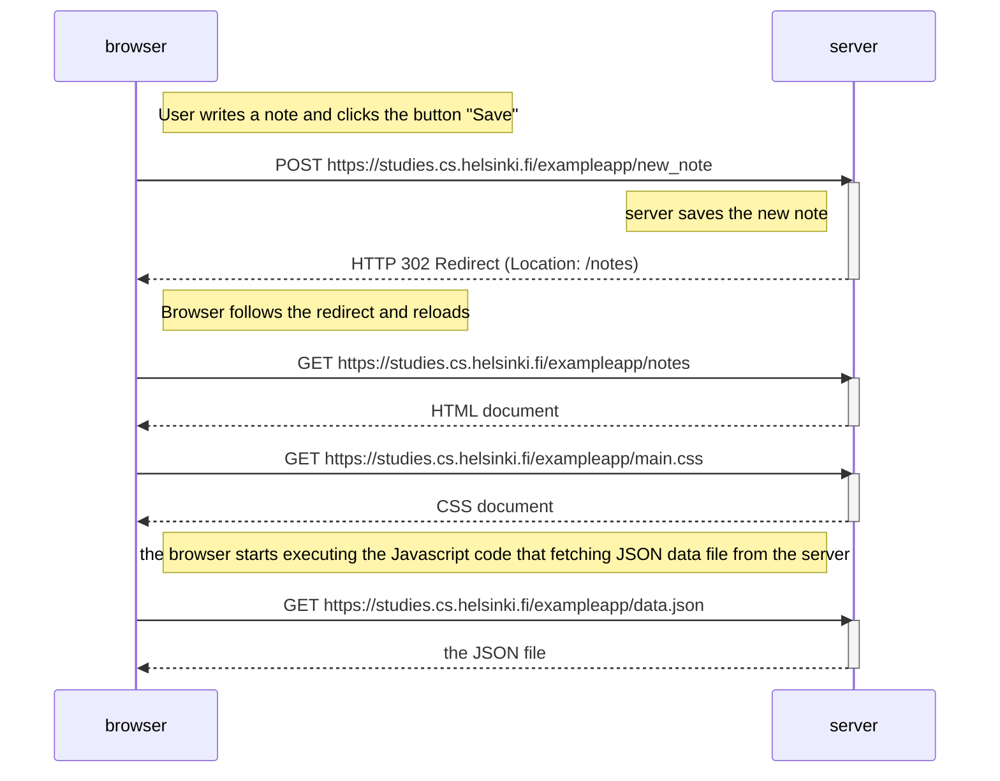

```mermaid

sequenceDiagram
    participant browser
    participant server

    Note right of browser: User writes a note and clicks the button "Save"

    browser ->> server : POST https://studies.cs.helsinki.fi/exampleapp/new_note 

    activate server

    Note left of server: server saves the new note

    server -->> browser: HTTP 302 Redirect (Location: /notes)

    deactivate server

    Note right of browser: Browser follows the redirect and reloads

    browser ->> server: GET https://studies.cs.helsinki.fi/exampleapp/notes
    activate server

    server -->> browser : HTML document
    deactivate server

    browser ->> server: GET https://studies.cs.helsinki.fi/exampleapp/main.css
    activate server

    server -->> browser: CSS document
    deactivate server

    Note right of browser: the browser starts executing the Javascript code that fetching JSON data file from the server

    browser ->> server: GET https://studies.cs.helsinki.fi/exampleapp/data.json
    activate server

    server -->> browser: the JSON file
    deactivate server

```