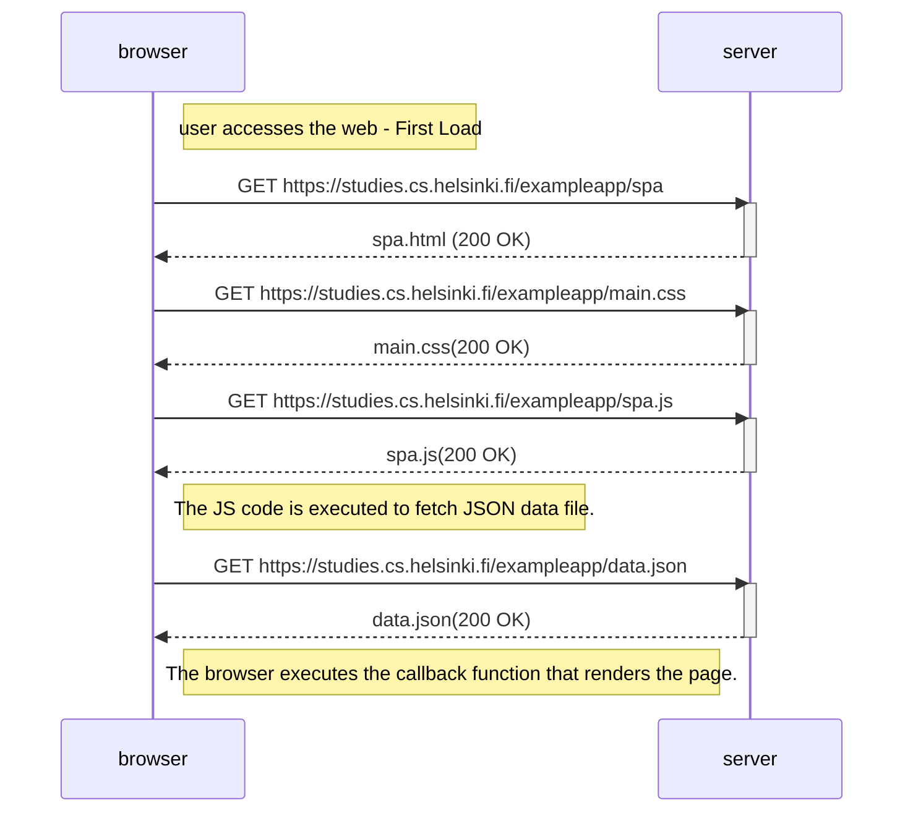

```mermaid
    sequenceDiagram
    participant browser
    participant server

    Note right of browser: user accesses the web - First Load

    browser ->> server: GET https://studies.cs.helsinki.fi/exampleapp/spa
    activate server

    server -->> browser: spa.html (200 OK)
    deactivate server

    browser ->> server: GET https://studies.cs.helsinki.fi/exampleapp/main.css
    activate server
    server -->> browser: main.css(200 OK)
    deactivate server

    browser ->> server: GET https://studies.cs.helsinki.fi/exampleapp/spa.js
    activate server
    server -->> browser: spa.js(200 OK)
    deactivate server

    Note right of browser: The JS code is executed to fetch JSON data file.

    browser ->> server: GET https://studies.cs.helsinki.fi/exampleapp/data.json
    activate server
    server -->> browser: data.json(200 OK)
    deactivate server

    Note right of browser: The browser executes the callback function that renders the page.


```